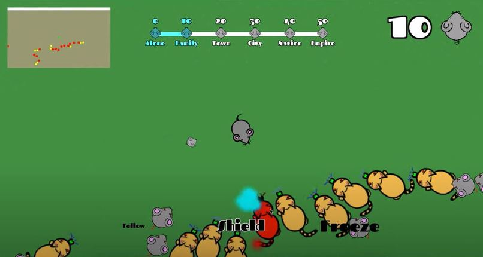

# Unity-TopDownShooter
A Top-Down-Shooting Game made with Unity and written in C#.
## How to play
Execute CUTE/Build/cute.exe to run the game.

## Game Backstory
The cats have acquired brainwashing taser equipment and have turned your friends into foes. It is up to you to save them.

## Objectives
Shoot the cats 3 times to kill them and shoot the brainwashed mice to convert them into allied mice. Bank these mice to increase your total score. A score of 50 banked mice is required to win the game.

## Controls
W.A.S.D for movement. Mouse to aim. Left Click or Space to shoot. Q/E to switch mice formations. R to bank mice.

## Game Strategies
When an allied mice collides with a cat, both will be destroyed. Allied mice can be ordered into 3 different formations to protect the player. The Follow formation makes the allied mice follow behind the player mouse. The Shield formation makes the allied mice revolve around the player mouse. The Freeze formation makes the allied mice freeze in their current positions. There are cooldowns for each of these formations, so the player needs to use them strategically.

## Special Gameplay Features
A mini-map is included in the top-left corner of the screen to allow the player to easily see incoming cats and enemy mice. Spawn rate of cats and brainwashed mice gradually increases as the player progresses in the game. When the player reaches 10, 20, 30, or 40 banked mice (scorebar at the top of the screen), a "Swarm Incoming" warning will appear while the screen flashes red to alert the player that a swarm of cats and brainwashed mice will be approaching. These swarms will become larger and larger as the player gets closer to the winning score of 50.

## Immersive Gameplay Features
A soothing background track is played throughout the game experience, and a special track is played when the player wins. Simple cartoon artwork for the sprites and background provides the player with an immersive gaming experience.
